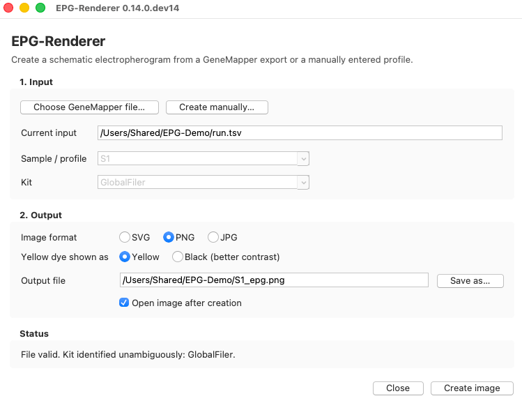

# Getting started and GUI manual

This guide describes the graphical interface for users who want an EPG figure without
writing code. To install and start the program, follow the
[installation guide](INSTALLATION.md).

## Create an image from a GeneMapper export

1. Select **Choose GeneMapper file…** and open the CSV, TSV, or TXT genotype-table
   export.
2. If the file contains multiple sample injections, select the required sample.
3. Confirm the automatically resolved kit. If several profiles are compatible,
   select the correct kit explicitly.
4. Choose SVG, PNG, or JPG (see [choose the output format](#choose-the-output-format))
   and review the proposed output path.
5. Under **Yellow dye shown as**, keep **Yellow** or choose **Black (better contrast)**
   when yellow peaks are hard to read, for example on a projector.
6. Select **Create image**.

The main window after opening a synthetic GlobalFiler export, shown on macOS; the
Windows program has the same controls.

[Reading the figure](READING_THE_FIGURE.md) explains what the image shows.

The GUI does not guess when no compatible kit can be established. See the
[GeneMapper input requirements](GENEMAPPER.md) when a file is rejected or kit
selection remains unavailable.

## Create a manual profile

1. Select **Create manually…**.
2. Choose the kit and enter a meaningful profile name.
3. Enter one or more alleles for each required marker. Separate multiple values with
   commas, semicolons, or spaces. Empty markers are permitted.
4. Choose one peak-height mode:

   - **Uniform schematic heights** records no RFU measurements, omits the RFU axis,
     and marks the output as non-quantitative.
   - **Enter RFU heights** requires one whole-number height from 1 through 32,767 for
     every entered allele.

5. Select **Use profile**, review the output settings, and create the image.

Technical kit controls are excluded from manual entry. Numerical off-ladder alleles
are accepted only when the selected coordinate model can position them safely.

## Choose the output format

- **PNG** or **JPG** for slides and documents, for example in PowerPoint, Keynote or
  Word. PNG keeps lines and text sharp.
- **SVG** for editing the figure in a vector graphics program such as Inkscape or
  Adobe Illustrator. Export it from there to the format you need.

The Windows program includes PNG and JPG support. A Python installation needs the
[raster components](INSTALLATION.md#png-and-jpg-output) for PNG and JPG; SVG always
works. PNG is preselected when PNG and JPG output is available, otherwise SVG.

## Troubleshooting

### The application does not start

See [if the program does not start](INSTALLATION.md#if-the-program-does-not-start).

### The GeneMapper file is rejected

Do not remove columns at random. Compare the export with the explicit
[input contract](GENEMAPPER.md); parser errors identify the violated boundary.

### PNG or JPG fails

Create SVG instead and export it with a vector graphics program, or install the
[raster components](INSTALLATION.md#png-and-jpg-output).

## Privacy and interpretation

EPG-Renderer performs its work locally and does not upload profile data. The output is
a schematic representation of called peaks, not a reconstruction of raw fluorescence
signal and not an independent analytical interpretation.

Continue with the [CLI guide](CLI.md), [Python vignette](PYTHON.md), or return to the
[documentation home](index.md).
