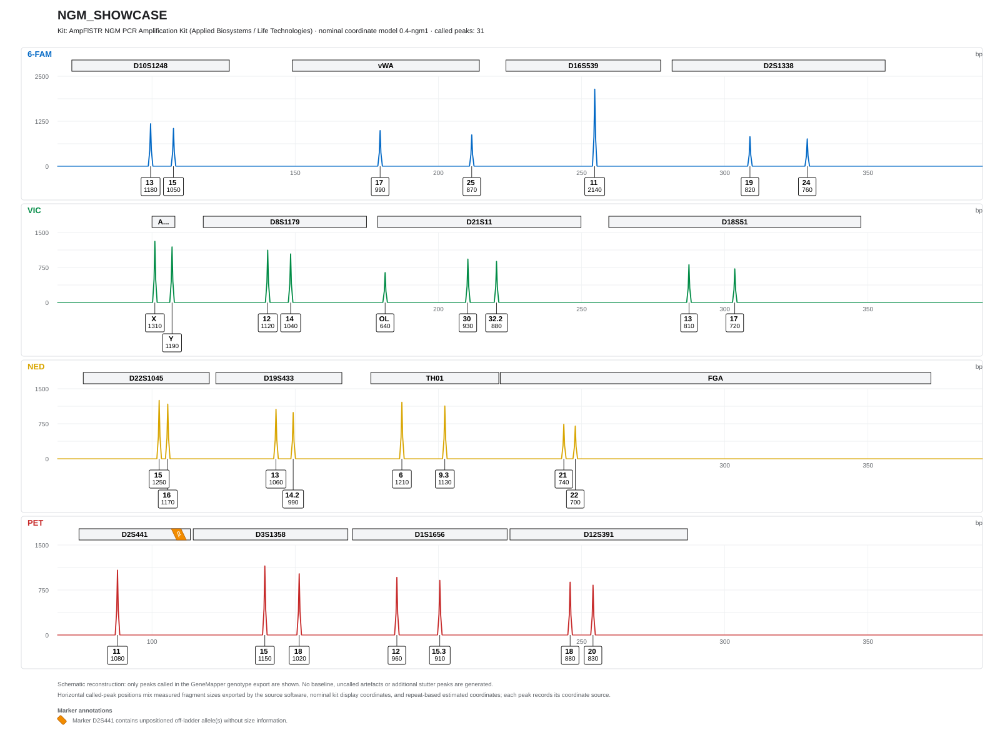

# Reading the figure

This page explains what an EPG-Renderer figure shows. The example is a synthetic NGM
profile that deliberately contains unusual calls; it is invented and does not come from
a person or a laboratory. Its input is the GeneMapper-style genotype table
[`ngm_showcase.tsv`](../tests/fixtures/ngm_showcase.tsv).

## Layout

- Each dye channel of the kit has its own panel, in kit order. For NGM these are
  6-FAM, VIC, NED and PET. The yellow dye NED is drawn in yellow or, if chosen, in
  black.
- The grey bars above the peaks are the size ranges of the kit's markers. A bar too
  narrow for the full name shows it shortened, here Amelogenin as "A…".
- The horizontal axis is in base pairs, the vertical axis in RFU per channel.
- Every called peak has a label box with the allele above and the exported RFU height
  below.

## The cases in this example

| Marker | In the export | In the figure |
|---|---|---|
| D16S539 | one allele, 11 | one peak with the exported height: a homozygous call |
| TH01, D19S433, D21S11, D1S1656 | microvariants 9.3, 14.2, 32.2, 15.3 | peaks at their positions in the allelic ladder, labelled with the full value |
| vWA | allele 25, outside the bundled ladder, no size | a peak at a position estimated from the repeat length |
| D21S11 | an off-ladder call `OL` with the size 181.4 bp | a peak at the exported size, labelled `OL` |
| D2S441 | an off-ladder call `OL` without a size | no peak; an orange `OL` ribbon at the marker bar and a line in the legend |
| Amelogenin | X and Y | two peaks |

The estimated vWA peak looks like every other peak. Only the second footer line and
the SVG data, which record the coordinate source of every peak, show that its position
is estimated. EPG-Renderer also reports it as a message.

The `OL` call without a size has no position, so it cannot be drawn as a peak. The
figure counts it as omitted and EPG-Renderer reports it as a message.

The `OL` call at 181.4 bp lies at the lower edge of the D21S11 range, just above the
D8S1179 range in the same dye. GeneMapper assigns a peak to the marker in whose size
range it lies, and the figure shows exactly this assignment. Whether such a peak is an
unusual D21S11 allele or a long D8S1179 allele cannot be decided from one kit; a second
kit with different amplicon sizes can resolve it.

## Footer

- The first line states that the figure is a schematic reconstruction of the called
  peaks only.
- The second line names the coordinate sources used in this figure: measured sizes
  from the export, nominal positions from the kit definition and estimated positions.
- Under **Marker annotations**, every marker with an `OL` call without a size is
  listed.

## What the figure does not show

The figure contains no baseline, no stutter or other artefacts and no peaks that were
not called in the export. Positions are measured only where the export contains sizes;
the [coordinate model](COORDINATE_MODEL.md) explains the other sources.

Return to the [GUI guide](GETTING_STARTED.md) or the [documentation home](index.md).
